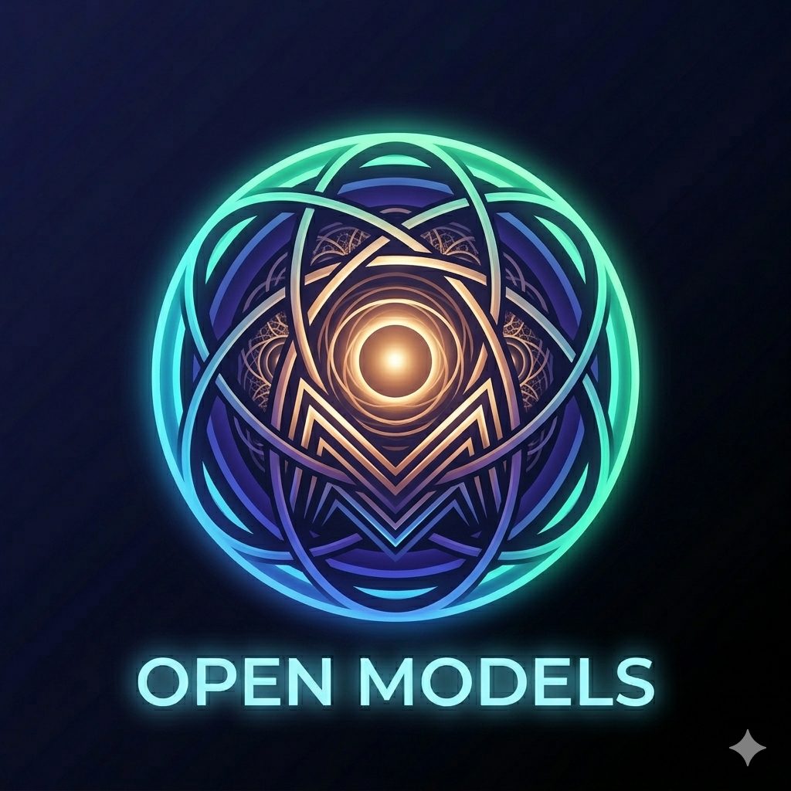
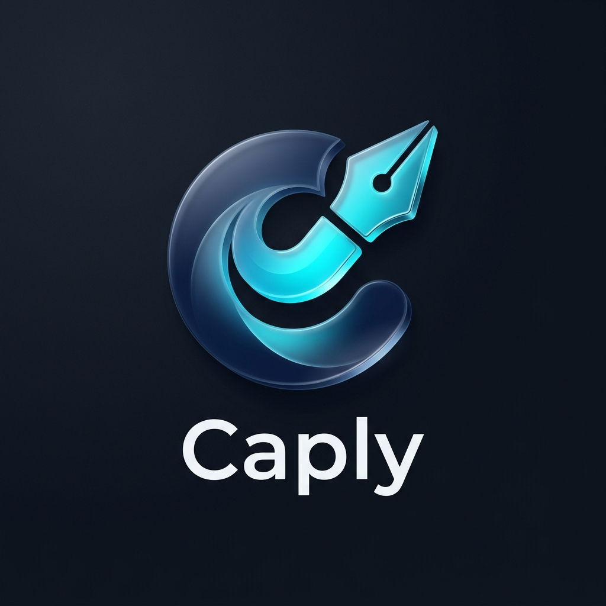
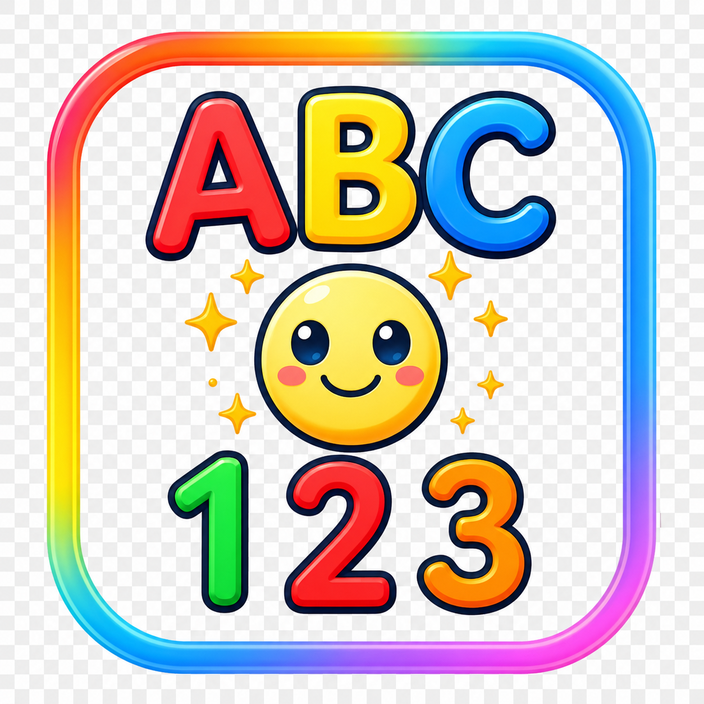
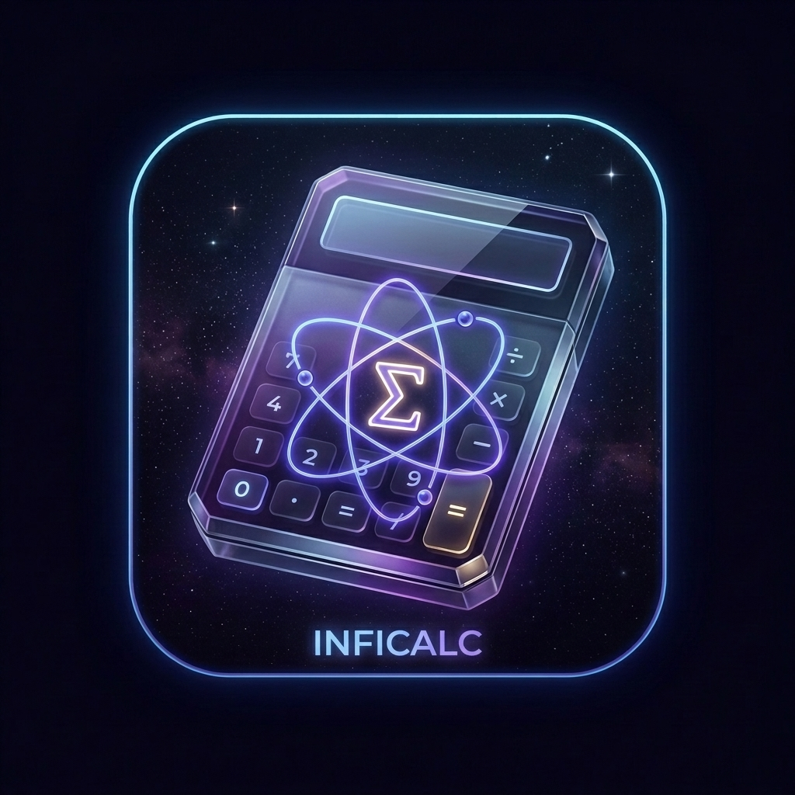

  

  

  
  
  
  

---

## 👨‍💻 About Me

Results-driven **Full-Stack Engineer** with **6+ years** of experience building scalable enterprise web and mobile applications. I specialize in **React.js**, **Spring Boot**, and **Flutter** — bridging frontend finesse with backend robustness. Passionate about **AI-assisted development**, I leverage GitHub Copilot and custom AI agents to accelerate delivery and elevate code quality.

- 🔭 Currently building enterprise solutions at **Equiniti India**  
- 🌱 Exploring **on-device AI/LLM inference** (Kotlin + Flutter)  
- 👯 Open to collaborate on **React, Spring Boot, or Flutter open-source**  
- 💬 Ask me about **React, Spring Boot, Microservices, Flutter, AI-assisted dev**  
- 📫 Reach me: **ianushree2006@gmail.com** | **+91-9980843619**  
- ⚡ Fun fact: I built an LLM chat app that runs entirely offline on Android  

---

## 🛠 Tech Stack

  
  
  
  
  
  

  
  
  
  
  
  

  
  
  
  
  

  
  
  
  
  

---

## 💼 Work Experience

<table>
  <tr>
    <td width="120"></td>
    <td>
       
      <strong>Software Engineer</strong> · <a href="https://www.equiniti.com">Equiniti India Private Limited</a> — Bangalore
       
      React.js · Java · Spring Boot · GitHub Copilot · SonarQube
      <ul>
        <li>Developed and maintained full-stack features for the <strong>EquiTrax</strong> application using React.js and Java.</li>
        <li>Designed reusable custom React components with responsive, user-friendly UI/UX implementations.</li>
        <li>Leveraged <strong>GitHub Copilot</strong> and AI-assisted practices to create custom AI agents, orchestrate workflows, generate unit tests, and resolve SonarQube findings.</li>
        <li>Collaborated with business stakeholders to gather requirements and ensure accurate feature delivery.</li>
      </ul>
    </td>
  </tr>
  <tr>
    <td></td>
    <td>
       
      <strong>Programmer Analyst</strong> · <a href="https://www.cognizant.com">Cognizant Technology Solutions</a> — Bangalore
       
      Java · React.js · Application Support · Root Cause Analysis
      <ul>
        <li>Provided application support by analyzing, troubleshooting, and resolving production/functional issues across Java and React.js applications.</li>
        <li>Investigated root causes of defects, implemented code fixes, and collaborated cross-functionally for timely resolution.</li>
      </ul>
    </td>
  </tr>
  <tr>
    <td></td>
    <td>
       
      <strong>Senior Software Engineer</strong> · <a href="https://www.ltimindtree.com">LTIMindtree</a> — Bangalore
       
      Java · React.js · MariaDB · Power BI · Agile
      <ul>
        <li>Developed frontend and backend for the <strong>Work Package Ordering (WPO) Tool</strong> using Java, React.js, and MariaDB.</li>
        <li>Implemented Service Catalogue modules, ERM data processing, Work Package Creation features, and Excel data import into MariaDB.</li>
        <li>Created and maintained <strong>Power BI</strong> dashboards; drove application enhancements, bug fixes, and performance improvements.</li>
        <li>Collaborated in Agile stand-ups using Git, Maven, Eclipse, VSCode, and deployment tools.</li>
      </ul>
    </td>
  </tr>
</table>

---

## 🎓 Education

  
   
  <b>Jain College of Engineering</b>, Belagavi, Karnataka

  
   
  <b>Tippu Shaheed Institute of Technology</b>, Hubli, Karnataka

---

## 📜 Certifications

  
  

---

## 🚀 Independent Projects

<table>
  <tr>
    <td width="50%">
      <h3 align="center"> OpenModels — On-Device AI</h3>
      

        Kotlin · Jetpack Compose · llama.cpp · Room DB
         
        
      

      

        Run <strong>20+ open-source LLMs</strong> (135MB–7B params) entirely offline on Android. Features chat interface, model browser, benchmark runner, telemetry dashboard, and dark/light themes.
      

    </td>
    <td width="50%">
      <h3 align="center"> Caply — AI Caption Generator</h3>
      

        Flutter · Dart · AdMob · AI Integration
         
        
      

      

        AI-powered caption generation app built with Flutter. Generates engaging captions using AI, with <strong>AdMob</strong> integration for monetization and a polished cross-platform UI.
      

    </td>
  </tr>
  <tr>
    <td width="50%">
      <h3 align="center"> TapPico — Kids Learning App</h3>
      

        Flutter · Dart · Riverpod · TTS · AdMob
         
        
      

      

        A colorful early-learning app for ages 2–6 with <strong>13 categories and 208+ items</strong>. Features tap-to-learn, MCQs, score tracking, and animated feedback.
      

    </td>
    <td width="50%">
      <h3 align="center"> InfiCalc — Smart Calculator</h3>
      

        Flutter · Dart · Advanced Math · Real-Time
         
        
      

      

        A powerful, intelligent calculator for advanced mathematical operations, scientific calculations, and real-time problem solving with precision and speed.
      

    </td>
  </tr>
  <tr>
    <td width="50%">
      <h3 align="center"> Food Order Microservice</h3>
      

        Java · Spring Boot · Eureka · API Gateway · Docker
      

      

        Microservices-based restaurant ordering system with service discovery, config server, API gateway, and multiple independent services (search, ordering, reviews, customers).
      

    </td>
    <td width="50%">
      <h3 align="center"> Vedica Labs</h3>
      

        HTML · CSS · JavaScript
      

      

        Organization website for Vedica Labs — a team building AI-powered apps including <strong>HireIQ</strong> (AI voice interviews, 4.8★, 2,400+ users) and <strong>Veer Gym</strong> management platform.
      

    </td>
  </tr>
</table>

  

---

## 📊 GitHub Analytics

  
  

  

  

---

## 📈 Contribution Activity

### 🏆 GitHub Trophies

  

### ⚡ Recent GitHub Activity
<!--START_SECTION:activity-->
<!--END_SECTION:activity-->

---

## 🤝 Let's Connect

  
  
  
  
  

  

  💡 *"From concept to deployment — I build products that matter."*
   
  ⭐ Feel free to star any repositories you find interesting!

<!--
🎵 Spotify Now Playing
To enable, deploy your own instance of novatorem (https://github.com/novatorem/novatorem)
and uncomment the line below with your deployed URL:
-->
<!-- 

 -->
